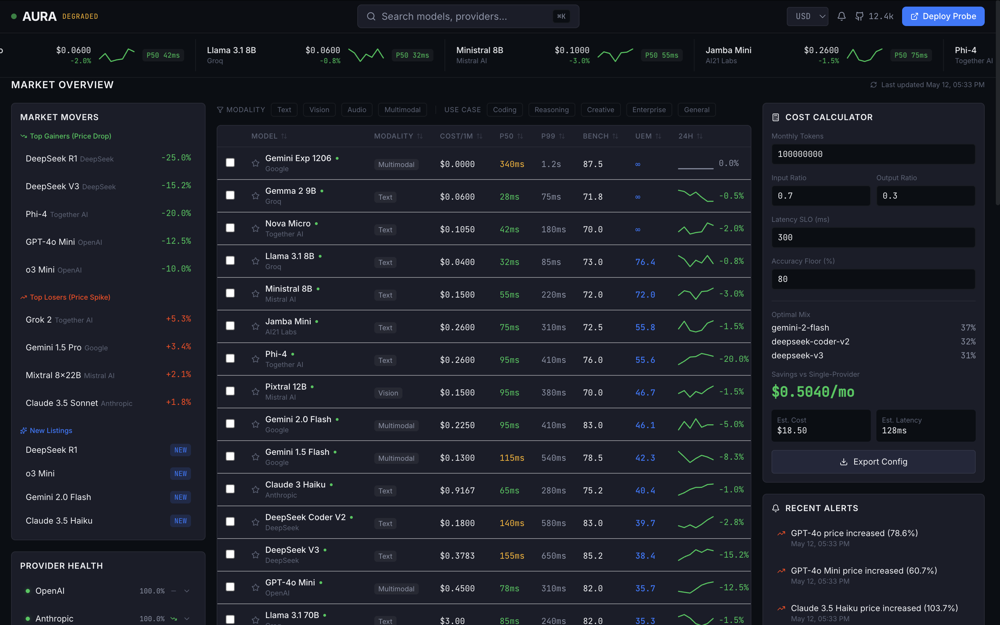
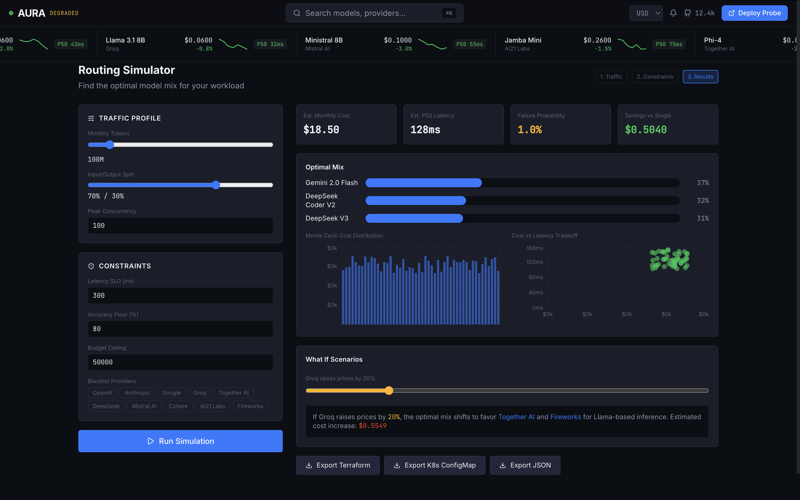
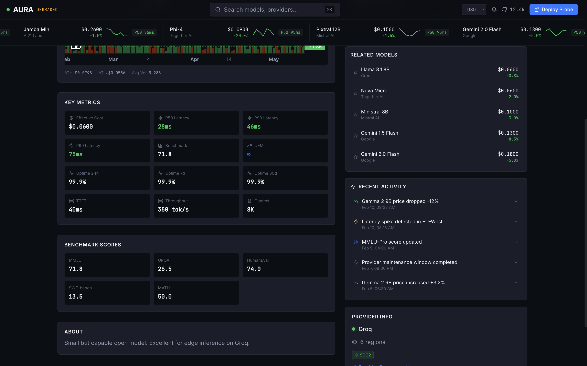
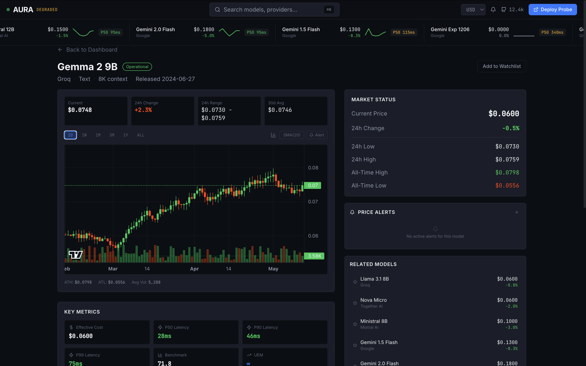

# AURA — AI Model Price Discovery Terminal






> The definitive price discovery and comparison terminal for the AI model economy. Institutional-grade credibility meets consumer-grade accessibility.


## Overview

AURA is a free, open-source web application that makes API cost optimization as intuitive as checking a stock chart. It aggregates pricing, latency, and benchmark data from every major AI inference provider into a single, high-density financial terminal.

### Key Features

- **Live Market Strip**: Ticker-style cards with real-time pricing, 24h changes, and latency badges
- **Market Overview Dashboard**: Sortable comparison table, market movers, provider health, watchlist
- **Cost Calculator**: Find optimal model mixes and calculate savings vs single-provider
- **Model Profiles**: Deep dives with price history charts, benchmark radars, true cost breakdowns
- **Routing Simulator**: Monte Carlo simulation for optimal traffic routing with "what if" scenarios
- **Benchmark Explorer**: Understand evaluation methodology and submit your own results
- **API Status Page**: Global probe network with regional latency matrices and historical uptime

## Quick Start

### Prerequisites

- Node.js 22+
- Docker & Docker Compose (optional)

### Local Development

```bash
# Clone the repository
git clone https://github.com/aura/terminal.git
cd terminal

# Install dependencies
npm install

# Start the dev server
npm run dev
```

The application will be available at `http://localhost:5173`.

### Docker Compose (Full Stack)

```bash
# Start the frontend + mock API
docker-compose up --build

# Frontend: http://localhost:3000
# Mock API:  http://localhost:8000
```

### One-Command Start

```bash
npx degit aura/terminal aura && cd aura && npm install && npm run dev
```

## Architecture

```
┌─────────────────────────────────────────────────────────────┐
│                        AURA Terminal                         │
├─────────────────────────────────────────────────────────────┤
│  React 18 + TypeScript + Vite                               │
│  ├── State: Zustand (lightweight, persisted)               │
│  ├── Styling: Tailwind CSS + Custom Design Tokens          │
│  ├── Tables: TanStack Table (virtualized, sortable)        │
│  ├── Charts: Recharts (radar, distribution, line)          │
│  ├── Price Charts: Lightweight-charts (TradingView-style)  │
│  └── Maps: MapLibre GL (open, no API key)                  │
├─────────────────────────────────────────────────────────────┤
│  Mock API: json-server (development)                        │
│  Future Backend: FastAPI + PostgreSQL + Redis               │
└─────────────────────────────────────────────────────────────┘
```

## File Structure

```
src/
├── components/
│   ├── Header.tsx              # Global sticky header
│   ├── MarketStrip.tsx         # Live ticker scroll
│   ├── SearchOverlay.tsx       # Cmd+K global search
│   ├── MarketMovers.tsx        # Gainers / losers / new
│   ├── ProviderHealth.tsx      # Provider status grid
│   ├── Watchlist.tsx           # User-pinned models
│   ├── ComparisonTable.tsx     # Main sortable table
│   ├── CostCalculator.tsx      # Optimization widget
│   ├── RecentAlerts.tsx        # Alert feed
│   ├── Sparkline.tsx           # Mini SVG charts
│   ├── ModelProfile.tsx        # Model detail overlay
│   ├── RoutingSimulator.tsx    # Full-page simulator
│   ├── BenchmarkExplorer.tsx   # Benchmark directory
│   └── StatusPage.tsx          # Global health map
├── pages/
│   └── Dashboard.tsx           # 3-column layout
├── store/
│   └── useAppStore.ts          # Zustand state
├── data/
│   └── mockData.ts             # 50 model profiles
├── types/
│   └── index.ts                # TypeScript definitions
├── lib/
│   └── utils.ts                # Formatting helpers
├── App.tsx                     # Router setup
├── main.tsx                    # Entry point
└── index.css                   # Global styles + Tailwind
```

## Design System

### Colors

| Token | Hex | Usage |
|-------|-----|-------|
| Base | `#0B0E14` | Background |
| Surface | `#1A1D29` | Cards |
| Text Primary | `#F0F2F5` | Headings |
| Text Secondary | `#8B93A7` | Labels |
| Green | `#00C853` | Savings, operational |
| Red | `#FF3D00` | Spikes, outages |
| Amber | `#FFB300` | Warnings, degraded |
| Blue | `#2979FF` | Accent, links |

### Typography

- **UI**: Inter (400, 500, 600, 700)
- **Numbers**: JetBrains Mono (tabular nums)

### Spacing

- Grid: 4px base
- Standard padding: 12px
- Section gaps: 16px

## Keyboard Shortcuts

| Key | Action |
|-----|--------|
| `/` or `Cmd+K` | Open search |
| `Esc` | Close overlays |
| `C` | Focus calculator |
| `R` | Refresh data |

## Data Model

### Unified Efficiency Metric (UEM)

```
UEM = (Accuracy × Reliability%) / (NormalizedCost × AvgLatency)
```

Higher is better. Surfaces the most cost-efficient models for a given capability level.

### Normalized Pricing

All provider pricing is normalized to **Effective USD per 1M tokens** using a canonical input/output split and accounting for caching/batch discounts.

## API (Development)

The frontend works against a mock API server for development:

```bash
npm install -g json-server
json-server --watch mock-api/db.json --port 8000
```

Endpoints:
- `GET /models` — All model profiles
- `GET /providers` — Provider health data
- `GET /alerts` — Recent alerts
- `GET /benchmarks` — Benchmark definitions

## Deployment

### Docker

```bash
docker build -t aura-terminal .
docker run -p 3000:80 aura-terminal
```

### Static Hosting

```bash
npm run build
# Deploy dist/ to Vercel, Netlify, S3, etc.
```

## Contributing

### Add Your Provider

Submit a PR with a pricing scraper in `scrapers/<provider>.ts` following the template in `scrapers/_template.ts`.

### Run a Probe

```bash
curl -sL https://aura.dev/probe.sh | bash -s -- --region us-east-1
```

### Code Style

- TypeScript strict mode enabled
- Tailwind utility-first CSS
- Components: PascalCase
- Utilities: camelCase
- No `any` types in production code

## License

- **Code**: MIT
- **Data**: CC0 (public domain)

## Funding

AURA is supported by GitHub Sponsors. See our [transparent budget dashboard](https://github.com/aura/terminal/funding).

---

Built with 💚 by the open source community.
